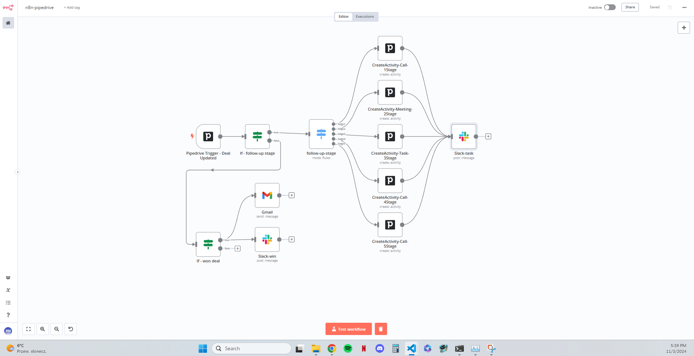

# n8n-pipedrive-integration

# Setup with Ngrok

Follow these steps to set up ngrok for Pipedrive authentication.

### 1. Download and Set Up ngrok

1. Visit the [ngrok download page](https://ngrok.com/download) and sign in or create a free account.
2. Download the appropriate version for your operating system (e.g., Windows).
3. Unzip the downloaded file to a preferred location on your computer, e.g., `C:\ngrok`.

### 2. Configure ngrok Authentication

1. Open a command prompt and navigate to the directory where ngrok is located.
2. Run the following command to add your authtoken to the default `ngrok.yml` configuration file:

    ```bash
    ngrok config add-authtoken <your authtoken>
    ```

   - You can find your authtoken on the ngrok dashboard. This token is required to authenticate your ngrok client with your account.

### 3. Start ngrok

1. To put your app online with an ephemeral domain, run ngrok to forward requests to your local service.
2. If your service is listening on `http://localhost:8080`, use the following command:

    ```bash
    ngrok http http://localhost:<yur_local_host>
    ```

3. This command will give you a public URL (e.g., `https://abcdefg.ngrok.io`) displayed in the command prompt.

### 4. Set Up Environment Variables

1. Use a public URL displayed in the command prompt to set up `WEBHOOK_URL` environment variable:

    ```bash
    $env:WEBHOOK_URL='<URL>'
    ```

Replace `<URL>`  with your actual public URL.

# Setup n8n

1. Use this link to instal self-hosted n8n with npx [self-hosting installation](https://docs.n8n.io/hosting/installation/npm/)

### Integration with Google Gmail

1. Use this guide to configure integration of n8n with Google Gmail [Google: OAuth2 single service](https://docs.n8n.io/integrations/builtin/credentials/google/oauth-single-service/?utm_source=n8n_app&utm_medium=credential_settings&utm_campaign=create_new_credentials_modal)

### Integration with Slack

1. Use this guide to configure integation with Slack [Slack credentials](https://docs.n8n.io/integrations/builtin/credentials/slack/?utm_source=n8n_app&utm_medium=credential_settings&utm_campaign=create_new_credentials_modal)

### Useful Links

- [ngrok Download](https://ngrok.com/download) - Download ngrok for your OS.
- [ngrok Dashboard](https://dashboard.ngrok.com/) - Access your account and authtoken.
- [Pipedrive Developer Portal](https://pipedrive.readme.io/) - Documentation and credentials for Pipedrive API integration.
- [Pipedrive API Documentation](https://developers.pipedrive.com/docs/api/v1/) - Complete API reference for Pipedrive.


### Screenshots

